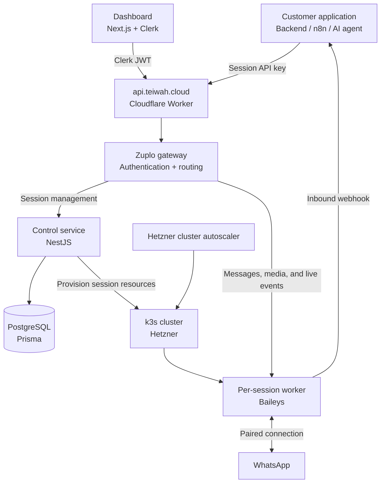

# Teiwah System Design: Flow & Architecture

## Overview

Teiwah was a programmable WhatsApp platform. It let an application, n8n workflow, or AI agent send and receive WhatsApp messages through an HTTP API and webhooks without implementing the WhatsApp protocol. A customer signed in to the dashboard, created a **session** for one WhatsApp account, scanned a QR code, and received an API key for that session.

The system separated account management from message delivery. A control service created and managed sessions, while every connected WhatsApp account ran in its own worker. This document describes the final implemented architecture by following a session from creation through pairing and message delivery.

> **Status:** Archived. Teiwah is no longer maintained or operated. The repositories and historical deployment details are preserved as a technical record of the project.

## Repository Map

Teiwah was implemented as seven repositories with separate deployment lifecycles:

| Repository | Responsibility |
| --- | --- |
| [`teiwah-control`](https://github.com/roman-sh/teiwah-control) | NestJS control service for users, sessions, provisioning, billing entitlement, and API-key consumers. |
| [`teiwah-worker`](https://github.com/roman-sh/teiwah-worker) | Stateful Baileys runtime that owned one WhatsApp connection and handled messages, media, and webhooks. |
| [`teiwah-zuplo`](https://github.com/roman-sh/teiwah-zuplo) | Public API gateway configuration and handlers for authentication, session routing, and media normalization. |
| [`teiwah-board`](https://github.com/roman-sh/teiwah-board) | Next.js dashboard for creating sessions, QR pairing, connection state, API keys, webhooks, and billing. |
| [`teiwah-infra`](https://github.com/roman-sh/teiwah-infra) | k3s and Hetzner infrastructure, Traefik routing, node autoscaling, deployments, and operations tooling. |
| [`teiwah-docs`](https://github.com/roman-sh/teiwah-docs) | Astro/Starlight guides and the OpenAPI-based interactive API reference. |
| [`teiwah-typescript-sdk`](https://github.com/roman-sh/teiwah-typescript-sdk) | Generated and handwritten TypeScript SDK published as [`teiwah`](https://www.npmjs.com/package/teiwah). |

---

## Core Architectural Principles

1. **A session was the central unit.** One session represented one linked WhatsApp account, one worker, one inbound webhook URL, and one API key. The same generated session ID identified the database row, Kubernetes resources, gateway consumer, API route, and logs.

2. **Every WhatsApp account had an isolated runtime.** Each session ran in its own worker pod with separate connection and authentication state. A failed or restarted session did not share runtime state with another customer.

3. **The control service was the system of record.** It owned account configuration, session ownership, webhook destinations, billing identity, and resource provisioning. It did not hold live WhatsApp connection state.

4. **The gateway was the authenticated front door.** Dashboard requests used Clerk JWTs. Customer applications used a session API key. Zuplo validated both and routed each request to either the control service or the correct session worker.

5. **Outbound traffic was API-driven; inbound traffic was webhook-driven.** Applications sent messages through Teiwah's API. Workers delivered incoming WhatsApp events directly to the webhook configured for their session. The dashboard was not involved in normal message delivery.

6. **The cluster was not directly public.** The control service and k3s routes were reached through Cloudflare Tunnel. Traefik routed session-specific paths inside the cluster.

7. **Capacity followed session demand.** A session consumed one worker pod. Kubernetes scheduled those pods, and the Hetzner-aware autoscaler added or removed worker servers when cluster capacity changed.

---

## System at a Glance

### Historical production layout

These URLs document where the final system ran. The hosted project is archived, so they are not expected to remain reachable.

- **Dashboard:** [`teiwah.cloud`](https://teiwah.cloud) — Next.js on Vercel.
- **Public API edge:** [`api.teiwah.cloud`](https://api.teiwah.cloud) — Cloudflare Worker forwarding to the Zuplo production gateway.
- **Control service:** `control.teiwah.cloud` — NestJS on Coolify, exposed through Cloudflare Tunnel.
- **Session ingress:** `k3s.teiwah.cloud` — Traefik routes into the Hetzner k3s cluster through Cloudflare Tunnel.
- **Developer documentation:** [`docs.teiwah.cloud`](https://docs.teiwah.cloud) — Astro/Starlight on Cloudflare Pages.
- **Worker images:** `ghcr.io/roman-sh/teiwah-worker:amd64` — built by GitHub Actions and pulled by session deployments.

---

## Flow 1: Provisioning a Session

Creating a session touched the dashboard, gateway, control service, Kubernetes cluster, Zuplo, and database.

1. The dashboard sent `POST /sessions` with the customer's Clerk JWT. The Cloudflare edge forwarded it to Zuplo, which authenticated the request and passed the user ID to control.

2. Control checked the user's provisioning limits and live billing entitlement before creating any resources. A rejected request did not leave a partial session behind.

3. Control generated a readable session ID such as `rival-centipede-2828`. That ID became the common identifier across PostgreSQL, Kubernetes, Zuplo, routes, and logs.

4. Control created a Kubernetes Deployment, Service, Ingress, Traefik strip-prefix middleware, and persistent authentication volume for the worker.

5. It created a Zuplo consumer with the same session ID and issued an API key scoped to that consumer.

6. Only after the external resources existed did control save the session in PostgreSQL. The complete API key was returned to the dashboard, while the database stored only its masked suffix.

7. Control watched the Kubernetes rollout and logged the worker's progress from scheduling to readiness. The dashboard could show the session immediately while its runtime was still starting.

The fixed provisioning order was intentional: infrastructure first, gateway identity second, and the visible database record last. This reduced the chance of showing customers a session that could never become usable.

---

## Flow 2: Connecting WhatsApp

After the worker started, the customer linked a WhatsApp account through a live dashboard flow.

1. The dashboard opened `GET /sessions/{id}/events`, a Server-Sent Events stream routed by Zuplo directly to the session worker.

2. The worker initialized Baileys and emitted its current state. When WhatsApp supplied a QR code, the worker sent it over the same event stream.

3. The customer scanned the QR code in WhatsApp. Teiwah supported QR pairing only.

4. Baileys saved the resulting authentication state on the session's persistent volume. The worker notified control of the connected phone number, and the dashboard changed the session to its connected state.

5. Closing the dashboard did not affect the WhatsApp connection. The worker remained alive and continued handling messages independently.

Newly provisioned routes could briefly return `502` or `503` while Kubernetes and Traefik became ready. The dashboard treated those responses as startup state and retried the initial event-stream connection.

---

## Flow 3: Sending and Receiving Messages

### Outbound: application to WhatsApp

1. A customer application called the public API with its session API key as a Bearer token.
2. Zuplo validated the key and resolved its consumer name. Because the consumer name was the session ID, the gateway immediately knew which worker should receive the request.
3. The gateway forwarded the operation to `k3s.teiwah.cloud/sessions/{sessionId}/...`. Traefik removed the session prefix and routed it to the worker's Service.
4. The worker sent the text, media, typing state, or read receipt through its live Baileys connection.

The worker did not validate customer API keys itself. Authentication and session resolution had already happened at the gateway.

### Inbound: WhatsApp to application

1. Baileys emitted an incoming message to the session worker.
2. The worker loaded that session's webhook URL from control.
3. It transformed the Baileys event into Teiwah's public webhook shape and posted it directly to the customer's HTTPS endpoint.
4. The customer could reuse the inbound `chatId` unchanged when sending a reply through the API.

Inbound delivery deliberately bypassed the gateway because it was an outgoing request from the worker, not a public Teiwah endpoint. For media, the worker retained the information needed for an authenticated download through `GET /media/{id}`. PTT voice messages were delivered with inline base64 so they could be transcribed immediately.

---

## Flow 4: Session Lifecycle and Recovery

A worker distinguished temporary connection loss from an explicit logout or invalid authentication state. Transient socket failures could reconnect without telling the dashboard that the account needed a new QR code.

- **Restart:** Kubernetes recreated the pod while keeping its session configuration. Authentication persisted when the replacement pod could mount the same node-local volume.
- **Reconnect:** The existing session and API key remained, while the worker initiated a fresh WhatsApp connection flow and exposed a new QR code when required.
- **Disconnect:** The worker logged out of WhatsApp and erased its authentication state, but kept the Teiwah session, API key, webhook URL, and billing slot. Reconnecting then required a new QR scan.
- **Delete:** Control removed the Kubernetes resources and Zuplo consumer, then soft-deleted the database session. Subscription quantity was managed separately.

The final infrastructure used node-local persistent storage. It survived ordinary same-node pod restarts, but moving a session to a different server could require the customer to scan a new QR code. This was a known tradeoff between operational simplicity and cross-node recovery.

---

## Flow 5: Billing and Entitlement

Freemius was the live source of truth for how many concurrent sessions a customer could run.

- Before provisioning, control resolved the customer's Freemius identity and read the active license and quota. It did not create a worker when entitlement could not be verified.
- The dashboard opened the Freemius checkout for a new subscription or additional quantity, then retried session creation against the live entitlement.
- License webhooks did not immediately delete sessions. They scheduled a delayed, de-duplicated BullMQ job backed by Redis.
- When that job ran, control re-read the current license. If the account was still over quota, it removed the newest excess sessions first.

The delayed reconciliation prevented bursts of provider webhooks or temporary billing state changes from repeatedly destroying infrastructure.

---

## Data Model

Control stored configuration in PostgreSQL through Prisma. Live WhatsApp state remained inside the workers.

### `User`

- Clerk user ID and email
- Freemius user ID
- Concurrent-session and daily-provisioning safety limits

### `Session`

- Generated session ID and owning user ID
- Connected phone number
- Inbound webhook URL
- Masked API-key suffix
- Soft-delete state

An `active_sessions` database view exposed non-deleted sessions for normal reads. Soft-deleted records remained available for provisioning-limit enforcement and operational history.

| Field | Written by | Purpose |
| --- | --- | --- |
| `Session.id` | Control during provisioning | Shared identifier across every service |
| `Session.userId` | Control during provisioning | Session ownership |
| `phoneNumber` | Worker after pairing | Connected WhatsApp account |
| `webhookUrl` | Dashboard through control | Inbound message destination |
| `apiKeyMasked` | Control during provisioning | Recognition in the dashboard without storing the secret |
| `User.freemiusUserId` | Provisioning gate | Stable billing identity |

---

## API and Authentication Boundaries

| Route group | Authentication | Destination |
| --- | --- | --- |
| `GET/POST /sessions`, `DELETE /sessions/{id}` | Clerk JWT | Control service |
| `GET /sessions/{id}/api-key`, `PATCH /sessions/{id}/webhook` | Clerk JWT | Control service |
| `POST /billing/checkout`, `GET /billing/portal` | Clerk JWT | Control service |
| `GET /sessions/{id}/events` | Clerk JWT | Session worker via SSE |
| `POST /sessions/{id}/reconnect`, `POST /sessions/{id}/disconnect` | Clerk JWT | Session worker |
| `POST /messages`, `POST /typing`, `POST /read` | Session API key | Session worker |
| `GET /media/{id}` | Session API key | Session worker |

Workers also called private control routes to load their configuration, save the connected phone number, and authorize a newly paired number. Those operations were not part of the customer API.

The database never stored the full session API key. Zuplo owned the secret and could return it to an authenticated dashboard request when a customer explicitly revealed the key.

---

## Infrastructure and Autoscaling

The runtime cluster used k3s on Hetzner. A static master hosted the Kubernetes control plane, while session workloads ran on labeled worker nodes.

Each session consisted of:

- one Deployment and worker pod;
- one internal Service;
- one Ingress route under `/sessions/{sessionId}`;
- one Traefik middleware to remove that path prefix;
- one persistent volume for Baileys authentication state; and
- one Zuplo consumer and session API key.

The cluster-autoscaler used the Hetzner Cloud API to create additional worker servers when session pods could not be scheduled. Low-priority placeholder pods reserved warm capacity: real session pods displaced them, and the resulting pending placeholders triggered scale-up before the cluster was completely full. Empty autoscaled nodes could later be removed.

The [`teiwah-infra`](https://github.com/roman-sh/teiwah-infra) repository also contained the cloud-init worker bootstrap, GHCR pull-secret setup, namespace separation, cleanup scripts, rollout commands, and an OliveTin operations panel for routine cluster actions.

---

## Documentation and TypeScript SDK

The developer documentation was a separate Astro + Starlight site at [`docs.teiwah.cloud`](https://docs.teiwah.cloud). Scalar rendered the interactive API reference from `public/openapi.yaml`, while handwritten MDX guides covered authentication, webhooks, media, and n8n integration.

The OpenAPI contract also generated the low-level TypeScript client. The [`teiwah-typescript-sdk`](https://github.com/roman-sh/teiwah-typescript-sdk) repository added a handwritten facade with shorter method names such as `sendText`, `sendImage`, and `sendPtt`, discriminated URL-or-base64 media inputs, inbound webhook types, and editor-focused JSDoc. It was published to npm as [`teiwah`](https://www.npmjs.com/package/teiwah).

Keeping the generated transport beneath the facade allowed the HTTP contract to be regenerated without exposing generated operation names as the developer-facing API.

---

## Observability and Operations

Backend services emitted structured JSON logs to Better Stack. Common fields such as `service`, `sessionId`, `userId`, and `requestId` made it possible to follow provisioning and messaging activity across service boundaries.

Operational tooling covered the actions required by the per-session model: inspecting pods, restarting one or all workers after a new image, cleaning orphaned session resources, provisioning the development namespace, and checking rollout status. GitHub Actions built the worker image and published it to GHCR; the individual hosting platforms deployed the control service, dashboard, documentation, and gateway from their own repositories.

---

## Security Boundaries

- Clerk authenticated dashboard users; Zuplo translated the verified identity into control-plane requests.
- Session API keys were validated at the gateway and mapped to exactly one worker route.
- Full API keys remained in Zuplo. PostgreSQL stored only a masked suffix.
- Cloudflare Tunnel hid the control and k3s origins from direct public access.
- Worker pods trusted requests arriving through the internal gateway route, making the gateway and tunnel boundary part of the security model.

---

## Why Development Stopped

Teiwah depended on Baileys and the unofficial WhatsApp Web protocol. Changes to WhatsApp made independent client implementations unreliable and no longer viable as the foundation of this service. Continuing would have required an ongoing compatibility race with unacceptable stability risk, so the project was discontinued.

The repositories remain public to document the architecture, implementation, deployment model, and operational work completed before the project was archived.
