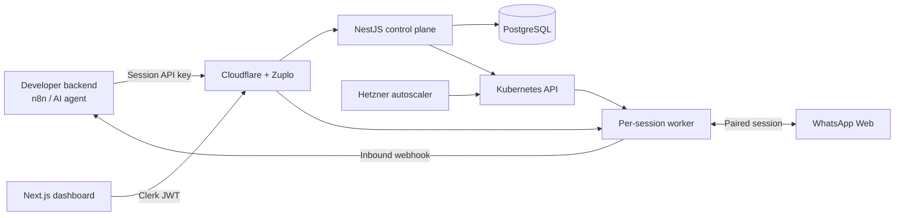

# Teiwah

Teiwah is an end-to-end WhatsApp automation platform built around isolated, per-number runtimes. A user pairs a number by scanning a QR code, then sends messages through an HTTP API and receives inbound messages through webhooks.

This repository is the entry point for the complete project. The implementation is split across seven focused repositories covering the control plane, messaging runtime, API gateway, dashboard, infrastructure, documentation, and TypeScript SDK.

> **Project status:** The source code remains available as a portfolio project. The hosted service is currently paused while the product direction is being evaluated.

## Architecture

The control plane owns accounts, session configuration, billing state, and Kubernetes resources. Each connected WhatsApp number runs in its own worker deployment with separate authentication state and lifecycle. The gateway resolves an authenticated request to the correct runtime; inbound events are delivered directly from that runtime to the customer's webhook.

## Repositories

| Repository | Responsibility |
| --- | --- |
| [`teiwah-control`](https://github.com/roman-sh/teiwah-control) | NestJS control plane for users, sessions, provisioning, entitlements, and API-key consumers. |
| [`teiwah-worker`](https://github.com/roman-sh/teiwah-worker) | Stateful WhatsApp runtime built on Baileys; handles pairing, outbound messages, inbound events, and webhooks. |
| [`teiwah-zuplo`](https://github.com/roman-sh/teiwah-zuplo) | Edge gateway configuration and handlers for authentication, routing, and media normalization. |
| [`teiwah-board`](https://github.com/roman-sh/teiwah-board) | Next.js dashboard for QR pairing, live connection state, API keys, webhooks, and account management. |
| [`teiwah-infra`](https://github.com/roman-sh/teiwah-infra) | k3s/Hetzner infrastructure, Traefik routing, node autoscaling, observability, deployment, and operations tooling. |
| [`teiwah-docs`](https://github.com/roman-sh/teiwah-docs) | Astro/Starlight API documentation, integration guides, and OpenAPI-based reference material. |
| [`teiwah-typescript-sdk`](https://github.com/roman-sh/teiwah-typescript-sdk) | Published typed client generated from the OpenAPI contract and wrapped in a developer-oriented facade ([`teiwah` on npm](https://www.npmjs.com/package/teiwah)). |

## Engineering highlights

- **Control plane and data plane separation.** Account and provisioning logic stays in the control service; message traffic is routed directly to the session that owns the WhatsApp connection.
- **Per-session isolation.** The control plane creates a dedicated Kubernetes deployment, service, ingress route, middleware, and persistent authentication volume for each connected number.
- **Elastic infrastructure.** A Hetzner-aware cluster autoscaler and warm-capacity workloads add or remove worker nodes as session demand changes.
- **Two authentication paths.** Dashboard operations use Clerk JWTs, while server-to-server message calls use scoped session API keys enforced at the gateway.
- **Contract-driven SDK.** The OpenAPI definition feeds a generated client, while the public facade adds concise method names, discriminated request types, and practical editor documentation.
- **Production operations.** The system includes structured logs, metrics, rollout and recovery actions, webhook diagnostics, and separate production and sandbox environments.

## Request lifecycle

1. A user creates a session in the dashboard.
2. The control plane provisions the session's Kubernetes resources and gateway identity.
3. The worker streams QR and connection-state events to the dashboard.
4. After pairing, authenticated API requests are routed to that session's worker.
5. The worker sends outbound messages through the paired account and forwards inbound events to the configured webhook.

## Technical scope

TypeScript, NestJS, Next.js, Baileys, PostgreSQL, Prisma, Redis/BullMQ, Kubernetes/k3s, Traefik, Hetzner Cloud, Zuplo, Cloudflare, GitHub Actions, Prometheus, Grafana Cloud, and Better Stack.

## Project boundary

Teiwah uses an unofficial WhatsApp Web integration and is not affiliated with or endorsed by WhatsApp or Meta. That dependency was a deliberate engineering tradeoff: it enabled QR-based user-authorized sessions and a simple HTTP API, while introducing upstream stability and policy risk that would need to be accepted for production use.
